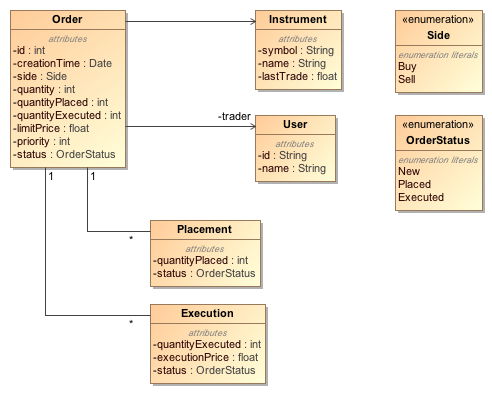
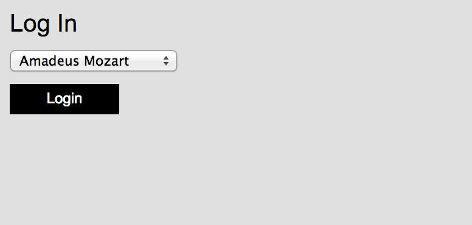
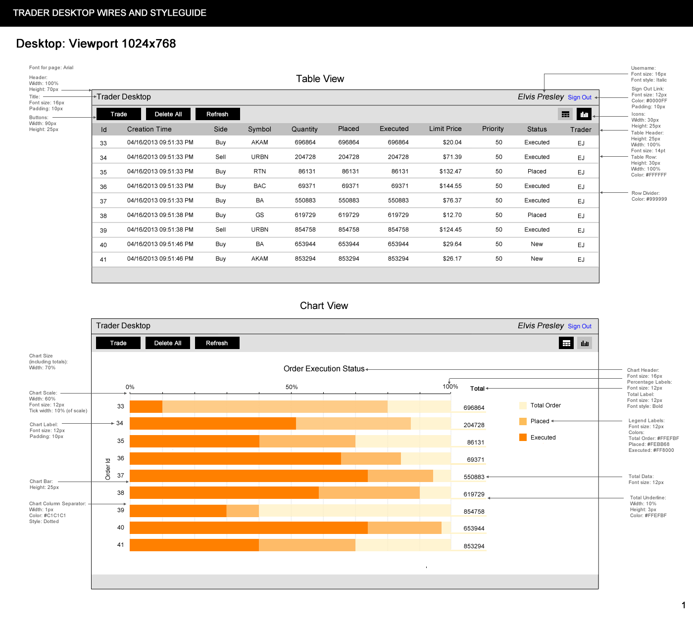
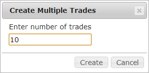
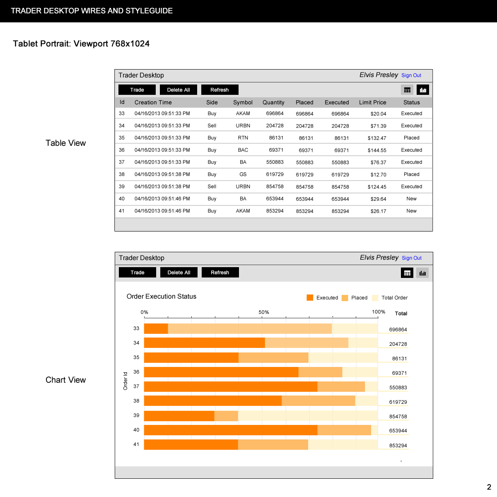
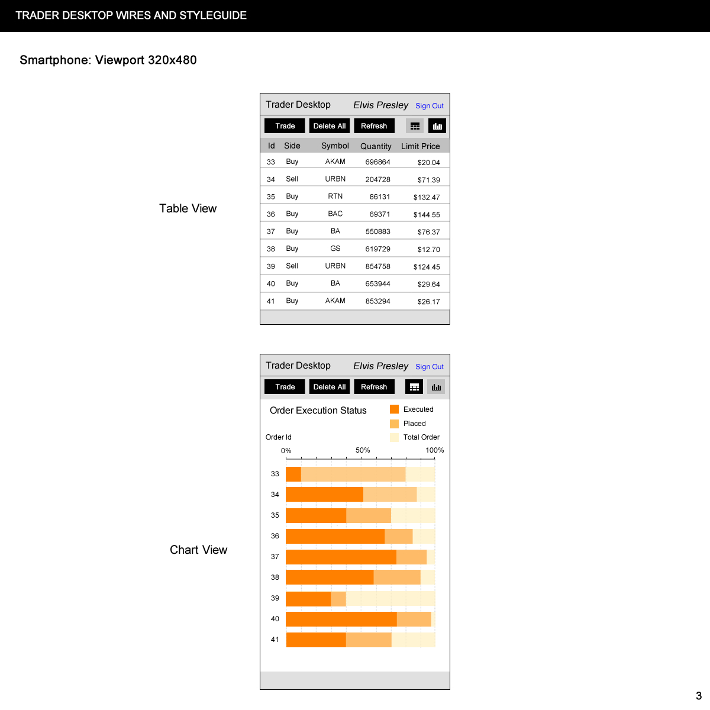
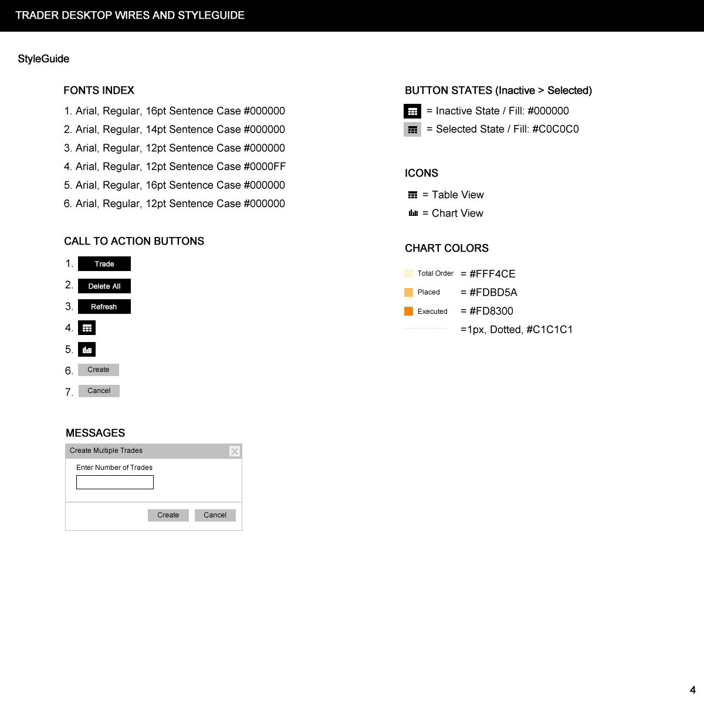

Trader Desktop
==============

This is an exercise in learning key web technologies using a simple trading scenario.

Domain Model
------------

The business domain consists of `Instruments` that can be traded in the financial market. We will limit the scope to equities (also knows as stocks).

Traders (who are system `Users`) can place `Orders` for different instruments in the stock market. Orders placed by the traders are sent to a server that manages the actual placement in the market. When the server receives a large order, it may break the order in to small chunks called `Placements` and push them to the market at different times. This makes sure that large orders do not swing the market in unintended ways. Also a large order may not get filled in one shot, it may require several `Executions` to fill - depending on the supply and demand of the stock.

The server keeps the trader informed about the progress of their orders. In fact, it keeps all traders informed about all orders, whether placed by them or other traders.

RESTful API
-----------
For the purpose of this exercise the server has been completely coded - you don't have to worry about it. You will only be coding the front-end.

The server exposes three RESTful resources: Users, Instruments and Orders. These are described below.

### Users ###

#### Get Users
Returns all Trader Desktop users. Assume all these users are traders.

##### Request
    GET http://localhost:8080/users HTTP/1.1

##### Response
    HTTP/1.1 200 OK
    Content-Type: application/json

    [
      {
        "id": "AM",
        "name": "Amadeus Mozart"
      },
      {
        "id": "AR",
        "name": "A. R. Rahman"
      },
      ...
    ]

### Instruments ###

#### Get Instruments
Returns all instruments traded at the exchange.

##### Request
    GET http://localhost:8080/instruments HTTP/1.1

##### Response
    HTTP/1.1 200 OK
    Content-Type: application/json

    [
      {
        "symbol": "AAPL",
        "name": "Apple Inc.",
        "lastTrade": 98.7
      },
      {
        "symbol": "ADBE",
        "name": "Adobe Systems Inc.",
        "lastTrade": 13.13
      },
      ...
    ]

### Orders ###
An order object has the following properties:

    id: int
    creationTime: date,
    side: 'Buy' | 'Sell'
    symbol: String
    quantity: int
    quantityPlaced: int
    quantityExecuted: int
    limitPrice: float
    priority: int  [1 (Low) - 100 (High)]
    status: 'New' | 'Placed' | 'Executed'
    traderId: String

#### Get Orders
Returns all orders saved on the server.

##### Request
    GET http://localhost:8080/orders HTTP/1.1

##### Response
    HTTP/1.1 200 OK
    Content-Type: application/json

    [
      {
        "id": 78,
        "creationTime": "2013-04-16T22:41:51.380Z",
        "side": "Buy",
        "symbol": "DIS",
        "quantity": 983444,
        "quantityPlaced": 983444,
        "quantityExecuted": 983444,
        "limitPrice": 31.46,
        "priority": 50,
        "status": "Executed",
        "traderId": "AM"
      },
      ...
    ]

#### Create Order
Creates an order on the server.

##### Request
    POST http://localhost:8080/orders HTTP/1.1
    Content-Type: application/json

    {
        "side": "Buy",
        "symbol": "AAPL",
        "quantity": 10000,
        "limitPrice": 426.24,
        "traderId": "AM"
    }

##### Response
    HTTP/1.1 201 Created
    Content-Type: application/json

    {
      "id": 10,
      "creationTime": "2013-04-17T00:01:18.000Z",
      "side": "Buy",
      "symbol": "AAPL",
      "quantity": 10000,
      "quantityPlaced": 0,
      "quantityExecuted": 0,
      "limitPrice": 426.24,
      "priority": 50,
      "status": "New",
      "traderId": "AM"
    }

#### Delete All Orders
Deletes all orders on the server.

##### Request
    DELETE http://localhost:8080/orders HTTP/1.1

##### Response
    HTTP/1.1 200 OK

Server Events
-------------
In addition to the RESTful resources described above, the server also pushes events to the client using WebSockets. This makes sure that all clients are aware of what is going on. For example, an order placed by trader A is visible to all other traders. Server events are described below.

#### orderCreatedEvent
The payload contains the order that was created.

#### placementCreatedEvent
The payload contains the placement that was created:

    orderId: int
    quantityPlaced: int
    status: 'New' | 'Placed' | 'Executed'

#### executionCreatedEvent
The payload contains the execution that was created:

    orderId: int
    quantityExecuted: int
    executionPrice: float
    status: 'New' | 'Placed' | 'Executed'

#### allOrdersDeletedEvent
This event is sent when all orders on the server are deleted.

Build Instructions
------------------
As mentioned earlier, the server is fully coded. Use the instrunctions below to build and run it.

### Install Build Tools ###
* Install [Node.js](http://nodejs.org/).
* Install [Grunt](http://gruntjs.com/getting-started).

        $ npm install -g grunt-cli

### Build the Server ###
* Clone the Trader Desktop repository on your machine.
* Open a command shell and change the directory to the local instance of the repository.
* Install the required NPM packages:

        $ npm install
* Start the server using the following command:

        $ npm start
* Make sure the server is running by pointing your browser to [http://localhost:8080](http://localhost:8080). You should see the server home page with the message "This is the Trader Desktop server".

### Run Diagnostics ###
We have a seperate web application to exercise the functionality of the server. This application is also very instructive in understanding the server API. Go to the [Trader Desktop Server Diagnostics](https://github.com/archfirst/trader-desktop-server-diagnostics) project to build and run this application.

Trader Desktop Exercise
-----------------------
Now that we understand the business domain and the server API, here's your front-end exercise. You can build the front-end in any technlogy of your choice, however be sure to follow best practices:

- Do not mix HTML, CSS and JavaScript. These should be in seperate files.
- Structure your code for readability. Use proper indentation. Do not mix spaces and tabs. Our preference is all spaces and 4 space indents. Set up your editor to assist you with this.
- Modularize your code. Do not put all HTML in one file, all CSS in another and all JavaScript in yet another file! Break up the screens into smaller logical components and code them in seperate files and folders. You can use modularization techniques described in methodologies such as [BEM](http://bem.info/), [SMACSS](http://smacss.com/) and [OOCSS](https://github.com/stubbornella/oocss/wiki). Our personal preference is SMACSS.
- Use a preprocessor like Sass or Less to modularize your CSS.
- Use MVC principles to seperate your models, views and control logic. You can use an MVC framework like Backbone or AngularJS to do this.
- Use build tools like Grunt to automate repetitive tasks like minification, compilation, unit testing, linting, etc.
- Include JSHint in your build script to detect errors and potential problems in JavaScript code and to enforce coding conventions.
- Use testing frameworks such as Mocha, Jasmine, Karma and Cucumber to write unit and integration tests.
- Finally, maintain the integrity of the visual design. This means paying extra attention to measurements, colors and alignment of elements to implement a user interface that is pleasing to the eye and captures the soul of the design!

You can assume a reasonably modern browser supporting HTML5 (IE9+, latest Chrome, Firefox and Safari).

### Login Screen

The login screen allows the user to select their name. No passwrod is required. Clicking the Login button takes them to the Trader Desktop screen.

### Trader Desktop

The trader desktop shows all trades placed by all traders - with real-time updates of placements and executions. The trader desktop has two display modes - table and chart. The mode can be be changed by clicking on the icons in the upper right hand corner. These icons have been provided in the assets directory.

The three buttons in the top-left have the following functionality:

##### Trade
Pops up a dialog box asking for the number of trades to create. When the create button is clicked, create the requested number of trades using random symbols, quantities etc.

##### Delete All
Sends a messeage to the server to delete all existing orders. This is primarily for debugging purposes.

##### Refresh
Refreshes the desktop. When this button is clicked, get a fresh copy of all trades from the server and redisplay them. Again, this functionality is for debugging purposes.

### Push Notifications
Make sure that the front-end listens for push notifications sent by the server and updates the local orders accordingly. In fact, the front-end should not update orders based on user actions. User actions should simply be transmitted to the server, their result not displayed on the client until the corresponding push notifications arrives from the server. This allows all front-ends users to see updates simultaneously. A good test of your front-end implementation is to open it in multiple browsers, performing actions in one browser should update information on all browsers simultaneously.

### Bonus Points
To earn extra brownie points, make the Trader Desktop responsive. Here are tablet and mobile versions of the design to get you started:

### Style Guide
Use the style guide shown below to capture the intent of the visual design with precision.

